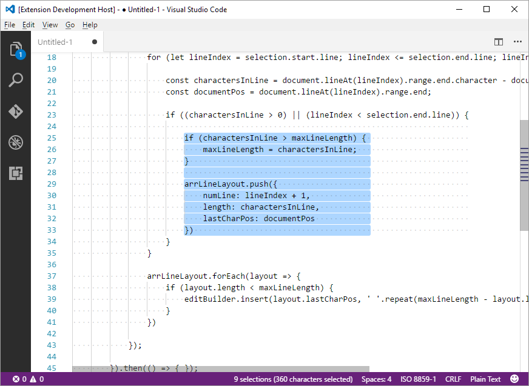
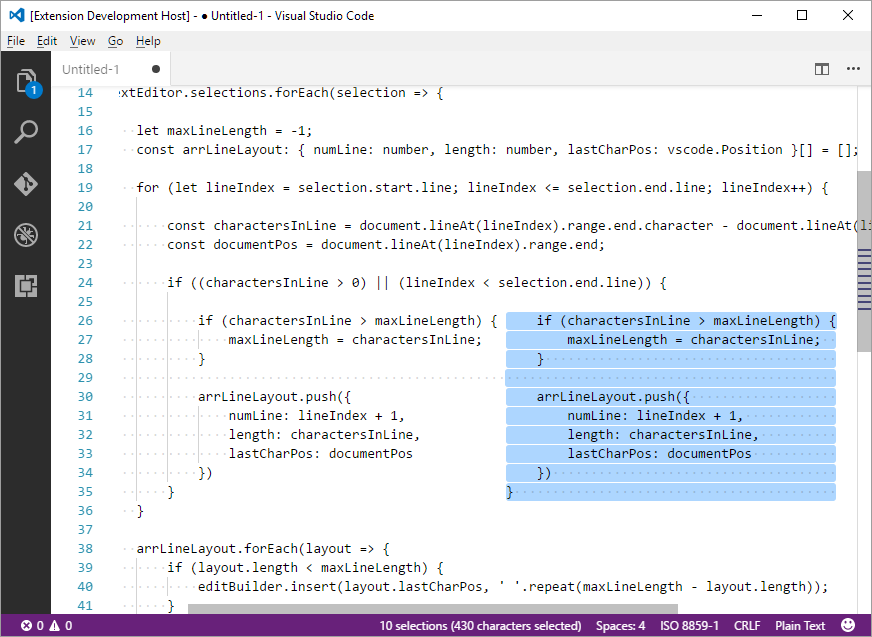

# EQUALIZE extension for Visual Studio Code

Append spaces on blocks of lines to make them the same size.

-----------------------------------------------------------------------------------------------------------

## Features

Given one or more groups of selected lines, this command would find out the length of the longest one and append spaces to the other lines, giving them all the same number of characters.

This is intended to make column/rectangle selections and operations more friendly.

-----------------------------------------------------------------------------------------------------------

## How to Use

* Select some lines and hit `ctrl+alt+l`.

* Alternatively, open the command pallete with `ctrl+shift+p` and type **equalize**.

-----------------------------------------------------------------------------------------------------------

## Screenshots

> Some lines have been 'equalized' and a perfectly square column of text could be selected among them.

> A column of text was copied alongside another one mantaining the original alignment thanks to equalized lines.

-----------------------------------------------------------------------------------------------------------

## Extension Settings

By default the command **'extension.equalize'** is assigned to `ctrl+alt+l`

-----------------------------------------------------------------------------------------------------------

## Release Notes

### 1.0.0

Initial release.
